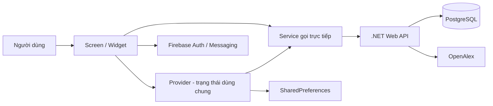

# Instructor: Workflow của ứng dụng Flutter ResearchHub

Tài liệu này mô tả **workflow đang thực sự tồn tại trong source code hiện tại** của project Flutter `Journal_Trend_Analysis`, không mô tả các màn hình mới chỉ có trong bản thiết kế. Mục tiêu là giúp thành viên mới biết:

- Có những role nào và mỗi role được đưa vào giao diện nào.
- Người dùng bấm ở đâu, màn hình/provider/service nào xử lý và API nào được gọi.
- Dữ liệu nào lấy từ PostgreSQL qua .NET API, dữ liệu nào chỉ tính trong Flutter và dữ liệu nào lưu cục bộ.
- Loading, empty, error, refresh, pagination và nút Back hoạt động ra sao.
- Các điểm chưa đồng nhất hoặc rủi ro cần biết trước khi phát triển tiếp.

> Phạm vi đối chiếu: thư mục `lib/` của Flutter và các endpoint .NET đang được Flutter gọi. Tài liệu được viết theo source hiện tại, không dựa riêng vào mockup.

---

## 1. Bức tranh tổng thể

Ứng dụng dùng các lớp theo luồng sau:



Ý nghĩa từng lớp:

1. **Screen/Widget** nhận thao tác, điều hướng và hiển thị loading/error/data.
2. **Provider** giữ trạng thái dùng chung giữa nhiều màn hình, gọi `notifyListeners()` để UI vẽ lại.
3. **Service** đóng gói HTTP, Firebase hoặc SharedPreferences.
4. **.NET API** đọc/ghi PostgreSQL. Flutter không gọi OpenAlex trực tiếp.
5. **OpenAlex** chỉ được backend gọi khi chạy đồng bộ thủ công/tự động.

Các file khởi đầu quan trọng:

- `lib/main.dart`: khởi tạo Firebase, Provider, theme, route và chọn shell theo role.
- `lib/config/app_config.dart`: base URL, page size, timeout và giới hạn kết quả.
- `lib/providers/`: state dùng chung.
- `lib/services/`: giao tiếp API/Firebase/local storage.
- `lib/screens/`: các màn hình và workflow giao diện.

---

## 2. Role và cách phân luồng

### 2.1 Bảng role thực tế

| Role ID | Tên gọi trong Flutter | Tên đang seed ở .NET | Shell sau đăng nhập | Bottom navigation |
|---|---|---|---|---|
| `1` | Admin | Admin | `AdminHomeScreen` | Dashboard, Users, Sync, Profile |
| `2` | Researcher | Moderator | `ResearcherHomeScreen` | Home, Analytics, Dashboard, Search, Profile |
| `3` | Customer/User thường | User | `HomeShell` | Home, Search, Bookmarks, Alerts, Profile |
| Giá trị khác | User thường | Không xác định | `HomeShell` | Giống role `3` |

Điểm cần nhớ:

- Flutter quyết định quyền bằng **chuỗi `roleId`**, không dựa vào `roleName`.
- Backend `AuthService` gọi role `2` là `ResearcherRoleId`, nhưng dữ liệu seed trong `Program.cs` đặt tên hiển thị là `Moderator`.
- Backend gọi role `3` là `CustomerRoleId`, nhưng dữ liệu seed đặt tên hiển thị là `User`.
- Vì vậy phải dùng ID `1/2/3` khi viết điều kiện. Không nên so sánh chuỗi `Admin`, `Researcher`, `Moderator`, `Customer` hoặc `User`.

### 2.2 Quy tắc tạo tài khoản

- Người dùng đăng ký công khai không được tự chọn Admin hoặc Researcher.
- Sau khi Firebase tạo tài khoản, backend tạo user mới với role mặc định `3`.
- Chỉ workflow quản lý user của Admin mới đổi role qua `POST /api/auth/assign-role`.
- Sau khi Admin đổi role, user đang đăng nhập vẫn giữ role cũ trong `AuthProvider`/SharedPreferences. User nên đăng xuất rồi đăng nhập lại để nhận shell mới.

### 2.3 Quyết định shell tại `_RootScreen`

`lib/main.dart` theo dõi `AuthProvider`:

1. `auth.isLoading == true`: hiện vòng xoay toàn màn hình.
2. Không có user cục bộ: hiện `LoginScreen`.
3. Có user và `roleId == "1"`: hiện `AdminHomeScreen`.
4. Có user và `roleId == "2"`: hiện `ResearcherHomeScreen`.
5. Các trường hợp còn lại: hiện `HomeShell`.

Đây là phân quyền giao diện phía client. Việc bảo vệ endpoint vẫn phải được thực hiện ở backend.

---

## 3. Workflow khởi động ứng dụng

### 3.1 Trình tự bootstrap

Khi gọi `main()`:

1. `WidgetsFlutterBinding.ensureInitialized()` chuẩn bị binding.
2. `Firebase.initializeApp(...)` khởi tạo Firebase bằng `firebase_options.dart`.
3. Status bar được đặt nền trong suốt.
4. `JournalTrendApp` tạo toàn bộ Provider.
5. `AuthProvider.load()`, `ProfileProvider.load()` và `BookmarkProvider.loadBookmarks()` bắt đầu đọc SharedPreferences.
6. `_RootScreen` chờ `AuthProvider` xong rồi chọn màn hình theo role.

### 3.2 Provider được đăng ký toàn ứng dụng

| Provider | Trách nhiệm chính |
|---|---|
| `ThemeProvider` | Light/dark mode trong phiên chạy hiện tại |
| `AuthProvider` | User hiện tại và role; lưu/đọc phiên cục bộ |
| `TopicsProvider` | Featured topics, tìm topic, fallback topic |
| `SearchProvider` | Query, filter, sort, kết quả, pagination, history |
| `DashboardProvider` | Analytics tính từ kết quả tìm kiếm đang tải |
| `RecentProvider` | Topic/bài báo xem gần đây trong RAM |
| `ProfileProvider` | Ngày dùng app và số lần tìm kiếm |
| `BookmarkProvider` | Bookmark cục bộ |
| `NotificationProvider` | Notification REST và FCM foreground |
| `ReportProvider` | Danh sách report và tạo report |

### 3.3 Hai hook quan trọng giữa Provider

Trong `main.dart`, `SearchProvider` được nối với:

- `DashboardProvider.recompute(...)`: mỗi lần tìm kiếm thành công, dashboard được tính lại từ danh sách bài vừa tải.
- `ProfileProvider.recordSearch()`: tăng bộ đếm số lần tìm kiếm thành công.

Do đó screen không cần tự gọi lại dashboard sau search.

---

## 4. Workflow xác thực dùng chung cho mọi role

## 4.1 Đăng nhập email/password

Màn hình: `lib/screens/login_screen.dart`.

1. User nhập email và password.
2. Form kiểm tra email có `@`, password không rỗng và tối thiểu 6 ký tự.
3. Nút Sign in bị vô hiệu hóa trong lúc xử lý.
4. Flutter gọi `FirebaseAuth.signInWithEmailAndPassword(...)`.
5. Lấy Firebase ID token bằng `getIdToken()`.
6. `AuthService.verifyIdToken()` gọi `POST /api/auth/verify-token` với `idToken`.
7. Backend xác minh Firebase token, tìm user theo Firebase UID:
   - Chưa có user: tạo user trong DB với role `3`.
   - Đã có: cập nhật email/full name, giữ role hiện tại.
8. Backend trả `User` có `userId`, `firebaseUid`, email, full name, `roleId`, `roleName`.
9. `AuthProvider.setUser()` lưu user vào SharedPreferences.
10. `_RootScreen` tự đổi sang shell phù hợp; login không push thêm một Home route.

Lỗi Firebase hoặc API được hiện trực tiếp dưới form. Trong lúc loading cả đăng nhập thường và Google đều bị khóa.

## 4.2 Đăng nhập Google

1. Tạo `GoogleSignIn` với `serverClientId`.
2. Mở account picker.
3. Nếu user hủy picker, loading được tắt và không đổi màn hình.
4. Lấy Google access token/ID token.
5. Đổi sang Firebase credential và đăng nhập Firebase.
6. Từ đây luồng giống email: Firebase ID token → `/api/auth/verify-token` → `AuthProvider.setUser()` → chọn shell theo role.

## 4.3 Đăng ký

Màn hình: `lib/screens/register_screen.dart`.

1. Nhập full name, email, password, confirm password.
2. Flutter validate full name, email, password tối thiểu 6 ký tự và hai password giống nhau.
3. Firebase tạo tài khoản.
4. Flutter cập nhật `displayName` trên Firebase user.
5. Lấy Firebase ID token và gọi `/api/auth/verify-token`.
6. Backend tạo user role `3`, không chấp nhận tự chọn role đặc quyền.
7. Lưu user vào AuthProvider và trở về root route.

## 4.4 Quên mật khẩu

Màn hình: `lib/screens/forgot_password_screen.dart`.

1. Validate email.
2. Gọi trực tiếp `FirebaseAuth.sendPasswordResetEmail(...)`.
3. Thành công: hiện thông báo kiểm tra inbox.
4. Thất bại: hiện message từ `FirebaseAuthException`.

Workflow này không gọi .NET API.

## 4.5 Khôi phục phiên đăng nhập

`AuthProvider.load()` chỉ đọc 6 khóa SharedPreferences:

- `auth_user_id`
- `auth_firebase_uid`
- `auth_email`
- `auth_full_name`
- `auth_role_id`
- `auth_role_name`

Chỉ khi đủ cả 6 giá trị mới khôi phục user. Hiện tại bước này **không gọi backend để kiểm tra role mới, trạng thái banned hoặc token còn hợp lệ**.

## 4.6 Đăng xuất

Màn hình: `ProfileScreen`.

1. User bấm Sign out.
2. Dialog xác nhận được mở.
3. Nếu đồng ý, Flutter gọi `FirebaseAuth.signOut()`.
4. `AuthProvider.clear()` xóa 6 khóa auth cục bộ.
5. `_RootScreen` tự trở về `LoginScreen`.

Bookmark, search history và profile activity không được xóa khi logout vì chúng là dữ liệu cục bộ riêng, không gắn user ID.

---

## 5. Role Customer/User thường (`roleId = 3`)

Shell: `lib/screens/home_shell.dart`.

`IndexedStack` giữ state và vị trí scroll của từng tab khi user đổi tab.

### 5.1 Tab Home

Màn hình: `TopicsScreen`.

#### A. Tải trang chủ

Sau frame đầu tiên:

1. Nếu `TopicsProvider.status == idle`, gọi `loadFeatured()`.
2. Service gọi `GET /api/topics/featured?take=50`.
3. Nếu API trả danh sách rỗng hoặc lỗi, Provider dùng 12 fallback topics cố định để Home không trắng.
4. Topic được nhóm theo `field`, nếu thiếu thì dùng `domain`, cuối cùng là `Other`.

Song song, `_DbHomeSection` gọi:

- `GET /api/stats`: tổng Papers, Authors, Journals, Topics.
- `GET /api/papers/popular?take=10`: top bài có `CitationCount > 0`, sắp xếp citation giảm dần rồi năm giảm dần.

Hai request chạy bằng `Future.wait`. Nếu lỗi, section ngừng loading nhưng không làm hỏng toàn trang Home.

#### B. Tìm topic trên Home

1. User gõ trong ô `Search topics`.
2. `Debouncer` trì hoãn để không gọi API ở từng ký tự quá dày.
3. `TopicsProvider.searchTopics(q)` gọi `GET /api/topics?q=...&take=25`.
4. Khi đang search: UI có shimmer, error view, retry và empty view riêng.
5. Xóa nội dung ô search sẽ gọi lại featured topics.

Đây là **tìm topic**, chưa phải tìm paper.

#### C. Chọn topic

1. Rung nhẹ bằng `HapticFeedback.selectionClick()`.
2. `RecentProvider.trackTopic(topic)` đưa topic lên đầu lịch sử gần đây.
3. `SearchProvider.clear()` xóa search cũ.
4. Push `SearchScreen(topic: topic, initialQuery: topic.displayName)`.
5. SearchScreen set active topic rồi tự chạy tìm kiếm.

Với topic có OpenAlex ID thật dạng `T` + số, Flutter gửi `topicId` về backend và bỏ `q` để lấy toàn bộ paper thuộc topic. Với fallback topic không có ID thật, Flutter dùng text query kết hợp tên topic.

#### D. Quick links trên Home

| Nút | Màn hình | Ý nghĩa |
|---|---|---|
| Dashboard | `DbDashboardScreen` | Dashboard toàn bộ dữ liệu trong DB |
| Trends | `TrendAnalysisScreen` | Trend DB nếu chưa search; analytics search nếu đã search |
| Reports | `ReportsScreen` | Xem/tạo PDF report |
| Database | `DatabasePapersScreen` | Danh sách paper DB và nút sync mặc định 50 |

Lưu ý: các quick link này đang xuất hiện cho cả Customer và Researcher vì cùng dùng `TopicsScreen`.

#### E. Recent Topics và Recent Publications

- Tối đa 12 item mỗi loại.
- Item mới nhất ở đầu; mở lại item cũ sẽ đưa lên đầu.
- Tap topic: chạy lại SearchScreen theo topic.
- Tap publication: mở lại PublicationDetailScreen.
- Có nút Clear riêng cho mỗi nhóm.
- Dữ liệu chỉ nằm trong RAM, đóng/restart app sẽ mất.

### 5.2 Tab Search

Màn hình: `SearchScreen`, state chính: `SearchProvider`.

#### A. Search toàn cục

1. User nhập query hoặc chọn suggestion/history.
2. `SearchProvider.search(query)` đặt status loading, xóa list cũ, page về 1.
3. `PaperSearchService.searchWorks()` gọi:

   `GET /api/papers?q=...&page=1&pageSize=30&sort=...`

4. Backend tìm trong **Title hoặc Abstract của PostgreSQL**, không gọi OpenAlex trong request search.
5. Thành công:
   - Lưu `items`, `total`, `hasMore`.
   - Đưa query vào đầu history, tối đa 8.
   - Tính lại DashboardProvider.
   - Tăng bộ đếm search trong ProfileProvider.
6. Thất bại: status error và UI hiện retry/error.

Search hiện chỉ đọc DB. Việc nhập paper mới chạy bằng background sync hoặc manual sync, không tự đồng bộ theo từ khóa trong request tìm kiếm.

#### B. Sort

Các lựa chọn Flutter gửi:

- Most Cited: `cited_by_count:desc`
- Least Cited: `cited_by_count:asc`
- Newest First: `publication_year:desc`
- Oldest First: `publication_year:asc`
- Most Relevant: `relevance_score:desc`

Đổi sort sẽ tự chạy lại query hiện tại. Backend hiện chưa có nhánh relevance riêng; giá trị không nhận diện rơi về mặc định citation giảm dần. Vì vậy “Most Relevant” hiện có hành vi giống “Most Cited”.

#### C. Filter

Bottom sheet cho phép:

- Từ năm / đến năm.
- Citation tối thiểu.
- Document type: journal article, conference paper, book, book chapter, dissertation, preprint.
- Tên author.
- Tên journal.
- Topic ID được quản lý qua topic picker/active topic.

Bấm Apply cập nhật `SearchFilters`, đóng sheet và chạy lại search. Các filter đang bật được hiện bằng chip; xóa chip sẽ refresh search. Clear Filters đưa filter về mặc định.

Backend ánh xạ thành các query param: `fromYear`, `toYear`, `minCitations`, `docType`, `topicId`, `authorName`, `journalName`.

#### D. Pagination

- Page mặc định: 30 paper.
- Scroll gần đáy 200 px sẽ gọi `loadMore()`.
- UI cũng hiện nút Load More ở cuối.
- Provider chống gọi chồng bằng `isLoadingMore`.
- Tổng số paper Flutter giữ tối đa `AppConfig.maxLoadedResults = 200`.
- `totalCount` vẫn là tổng record backend báo, có thể lớn hơn 200.

#### E. Dashboard từ kết quả search

Sau search, hai nút ở header kết quả mở:

- `DashboardScreen`: KPI, field breakdown, top author, bài ảnh hưởng nhất, top cited.
- `TrendAnalysisScreen`: trend, top cited, top journal, top author của tập đã tải.

Hai màn hình này tính **client-side trên tối đa 200 paper đã load**, không phải toàn bộ `totalCount`. Banner/method card dùng `apiTotalCount` để cho biết độ bao phủ.

#### F. Nút Back

`SearchScreen._handleBack()` xử lý hai trường hợp:

1. SearchScreen được push từ Home/topic: `Navigator.canPop()` đúng → pop về màn hình trước.
2. SearchScreen là tab gốc trong `HomeShell`/`ResearcherHomeScreen`: không có route để pop → gọi callback `onBack` để đổi bottom tab về Home.

Vì vậy nút Back không còn rơi vào trạng thái bấm nhưng không làm gì ở tab Search gốc.

### 5.3 Tab Bookmarks

Màn hình: `BookmarksScreen`, state: `BookmarkProvider`.

1. Bookmark từ card/detail gọi `BookmarkProvider.toggle(publication)`.
2. `BookmarkService` serialize publication thành JSON trong SharedPreferences key `bookmarks`.
3. Badge ở bottom nav hiện số lượng bookmark.
4. Tap bookmark mở PublicationDetailScreen.
5. Có thể xóa từng item hoặc Clear All sau dialog xác nhận.

Bookmark hiện là local-only, không dùng `/api/bookmarks`, không đồng bộ giữa thiết bị và không tách theo tài khoản.

### 5.4 Tab Alerts

Khi `HomeShell` khởi tạo:

1. `NotificationProvider.initPush()` yêu cầu quyền notification.
2. Nếu được phép, lấy FCM token và log ra debug console.
3. Subscribe topic FCM `new_papers` nếu platform hỗ trợ.
4. Lắng nghe notification foreground và thêm ngay vào đầu list in-app.
5. Lấy inbox bằng `GET /api/notifications?userId=...&page=1&pageSize=20`.

Trong `NotificationsScreen`:

- Có loading/error/retry/empty state.
- Pull-to-refresh hoặc nút refresh gọi lại API.
- Tap item chưa đọc gọi `PATCH /api/notifications/{notificationId}/read` và cập nhật badge.
- Tap notification hiện chỉ đánh dấu đã đọc, chưa điều hướng tới paper cụ thể.

Khởi tạo push hiện chỉ được gọi trong `HomeShell`, không được gọi trong shell Researcher/Admin.

### 5.5 Tab Profile

Xem mục [Workflow Profile dùng chung](#9-workflow-profile-theme-và-thống-kê-cục-bộ).

---

## 6. Role Researcher (`roleId = 2`)

Shell: `lib/screens/researcher_home_screen.dart`.

### 6.1 Tab Home

Dùng cùng `TopicsScreen` với Customer, nên có toàn bộ:

- Featured/search topic.
- DB stats và top cited.
- Quick links Dashboard/Trends/Reports/Database.
- Recent topic/publication.
- Theme, profile và bookmarks ở header.

### 6.2 Tab Analytics

Đây là hub riêng cho Researcher, có ba workflow.

#### A. Trend Analysis

Màn hình: `TrendAnalysisScreen`.

**Trước khi có search:**

1. `DashboardProvider.isReady == false`.
2. `_DbTrendFallback` gọi `GET /api/stats/dashboard`.
3. Hiện biểu đồ `papersByYear` của toàn DB.
4. Có pull-to-refresh và retry.

**Sau khi có search:**

Màn hình có 4 tab tính từ `DashboardProvider`:

1. Trend: số publication theo năm.
2. Top Cited: top 10 theo citation; tap mở detail.
3. Journals: top 5 journal theo số paper.
4. Authors: top author và evidence paper.

Đây là analytics cục bộ của tập kết quả đã tải, không gọi `/api/analysis/topic-trend` trong workflow màn hình này.

#### B. Compare Trends

Màn hình: `CompareTrendScreen`.

1. User thêm keyword; trùng keyword bị bỏ qua.
2. Tối đa 5 keyword.
3. Phải có ít nhất 2 keyword thì nút Compare mới bật.
4. Gọi `POST /api/analysis/compare-keywords` với `keywords`.
5. Backend trả chuỗi dữ liệu theo năm cho mỗi keyword.
6. Flutter ghép tất cả năm, vẽ nhiều line với màu khác nhau và legend.
7. Xóa/thêm keyword sẽ xóa kết quả cũ, yêu cầu compare lại.

UI hiện chưa cung cấp fromYear/toYear dù service đã hỗ trợ hai tham số này.

#### C. Emerging Topics

Màn hình: `EmergingTopicsScreen`.

1. Gọi `GET /api/analysis/emerging-topics?take=20`.
2. Hiện thứ hạng, số recent, tổng số và growth ratio.
3. Growth ratio từ `0.7` trở lên được đánh dấu nổi bật.
4. Pull-to-refresh gọi lại API.
5. Tap topic mở `TopicDetailScreen`.

### 6.3 Tab Dashboard

Màn hình: `DbDashboardScreen`.

1. Gọi `GET /api/stats/dashboard` kèm Firebase bearer token nếu có.
2. Hiện tổng Papers, Authors, Journals và average citations.
3. Hiện publication trend toàn DB.
4. Hiện top journals, top authors và most cited paper nếu payload có dữ liệu.
5. Có loading, retry và pull-to-refresh.

Dashboard này khác `DashboardScreen`:

| Màn hình | Nguồn dữ liệu | Có cần search trước? |
|---|---|---|
| `DbDashboardScreen` | Backend thống kê toàn DB | Không |
| `DashboardScreen` | Flutter tính trên kết quả search đã load | Có |

### 6.4 Tab Search

Giống toàn bộ workflow Search của Customer. Back ở tab gốc sẽ đưa về Home.

### 6.5 Tab Profile

Giống workflow Profile dùng chung.

### 6.6 Khác biệt cần biết

- Researcher không có tab Alerts và shell không gọi `initPush()`.
- Researcher không có tab Bookmarks riêng, nhưng vẫn có nút bookmark trên Home/detail và nút bookmark ở header Home.
- Các màn hình analytics chính là quyền khác biệt về UI, nhưng một số analytics vẫn có thể được Customer mở qua quick links Home.

---

## 7. Role Admin (`roleId = 1`)

Shell: `lib/screens/admin_home_screen.dart`.

## 7.1 Tab Dashboard

### A. Tải tổng quan

1. `AnalysisService.getAdminDashboard()` gọi `GET /api/admin/dashboard`.
2. Hiện 6 KPI:
   - Users và số banned.
   - Papers.
   - Topics.
   - Journals.
   - Authors.
   - Sync Logs.
3. Hiện recent sync logs nếu backend trả về.
4. Có nút refresh, pull-to-refresh, loading, error và Retry.

### B. Sync số lượng paper tùy chọn

Đây là workflow sync mới dành cho Admin:

1. Ô `Number of new papers` mặc định là `50`.
2. Chỉ cho nhập chữ số.
3. Flutter validate trong khoảng `1–1000`.
4. Khi hợp lệ, gọi:

   `POST /api/sync/works?requestedCount={N}`

5. Nút đổi thành `Syncing...` và bị khóa để tránh user bấm lặp.
6. Backend cũng validate `1–1000`.
7. Backend dùng `SemaphoreSlim` để chỉ cho một sync OpenAlex chạy tại một thời điểm.
8. Backend dùng cursor pagination, bắt đầu `cursor=*`, mỗi trang 100 work.
9. Backend scan nhiều hơn số yêu cầu để bù cho record trùng; số trang tối đa được tính theo N và clamp từ 20 đến 100.
10. Mỗi work được kiểm tra trùng bằng:
    - OpenAlex `ExternalId` là khóa chính nhận diện.
    - DOI đã normalize là lớp bảo vệ thứ hai.
11. Nếu trùng, tăng `SkippedDuplicates`, không insert paper đó.
12. Nếu mới, backend insert paper và quan hệ journal, author, keyword, topic.
13. Dừng khi insert đủ N, hết nguồn hoặc đạt giới hạn scan.
14. Ghi `SyncLog` với trạng thái:
    - `Success`: insert đủ N.
    - `Partial`: chưa đủ N.
15. Gửi FCM topic `new_papers` nếu có paper mới.
16. Recompute `ResearchTopic.WorksCount` từ bảng nối paper-topic.
17. Flutter hiện message bằng SnackBar rồi reload Admin Dashboard.

Response backend có `requestedCount`, `insertedCount`, `skippedDuplicates`, `scannedCount`, `sourceExhausted`; Flutter service hiện chỉ trả chuỗi `message` cho UI.

Các lỗi đáng chú ý:

- `400`: số ngoài khoảng.
- `409`: một sync khác đang chạy.
- `499`: client hủy/ngắt kết nối.
- `502`: không gọi được OpenAlex.
- `500`: lỗi DB hoặc lỗi nội bộ.

### C. Recompute trends

1. Bấm Run tại `Recompute publication trends`.
2. Gọi `POST /api/sync/trends`.
3. Trong lúc chạy nút được thay bằng progress indicator.
4. Kết quả hoặc lỗi được hiện bằng SnackBar.

## 7.2 Tab Users

### A. Tải danh sách

Flutter chạy song song:

- `GET /api/auth/users`
- `GET /api/auth/roles`

Sau đó hiển thị avatar, full name, email, role dropdown và trạng thái Banned.

### B. Đổi role

1. Admin chọn role khác trong dropdown.
2. Gọi `POST /api/auth/assign-role` với `userId`, `roleId`.
3. Thành công: SnackBar và reload toàn bộ user/role.
4. Backend chỉ chấp nhận ID `1`, `2`, `3`.

User bị đổi role nên đăng nhập lại để Flutter nhận role mới từ backend.

### C. Ban/Unban

- User chưa banned: gọi `PUT /api/admin/users/{userId}/ban`.
- User đã banned: gọi `PUT /api/admin/users/{userId}/unban`.
- Sau thành công reload danh sách.

Trong source hiện tại, cờ banned được quản lý/hiển thị nhưng luồng `VerifyIdTokenAsync` chưa kiểm tra `IsBanned` để từ chối đăng nhập. Do đó “Ban” chưa đồng nghĩa chắc chắn với khóa truy cập toàn hệ thống.

## 7.3 Tab Sync

Tab này là lịch sử sync, không phải form chạy sync:

1. `GET /api/admin/sync/logs?take=100`.
2. Hiện source API, thời gian, số record insert, status và error message.
3. Màu xanh cho Success, đỏ cho error/fail, cam cho trạng thái còn lại như Partial.
4. Có refresh, pull-to-refresh, loading, error và empty state.

Form chạy sync nằm trong tab Dashboard.

## 7.4 Tab Profile

Giống workflow Profile dùng chung.

---

## 8. Workflow paper và các màn hình drill-down

## 8.1 Mở Publication Detail

Màn hình: `PublicationDetailScreen`.

1. Screen nhận một `Publication` từ list/card.
2. Vì payload list có thể chỉ là summary, screen **luôn gọi lại** `GET /api/papers/{encodedPaperId}` nếu ID hợp lệ.
3. Detail endpoint trả:
   - Title, abstract, DOI, year, citation, doc type.
   - Journal đầy đủ hơn: name, publisher, ISSN.
   - Authors.
   - Keywords.
   - Topics.
4. Flutter thay publication summary bằng bản full rồi vẽ lại.
5. `RecentProvider.trackPublication()` ghi paper vào recent in-memory.

Màn hình hiển thị:

- Metadata năm/type.
- Citation, số author, journal, số topic.
- Citation Strength.
- Author chips.
- DOI và nút mở trình duyệt ngoài.
- Journal information.
- Topics & Keywords.
- Abstract.
- Bookmark và Share.

Nếu detail API lỗi, screen giữ dữ liệu summary ban đầu; phần thiếu có thể hiện `N/A` hoặc “No abstract available”.

## 8.2 Citation và topic lấy từ đâu

Đây là nguyên nhân thường gặp khi màn hình detail thiếu dữ liệu:

- `citationCount` lấy từ cột `Paper.CitationCount` trong DB, được ghi từ `OpenAlex.cited_by_count` tại thời điểm sync.
- Sync thủ công bỏ qua paper trùng, nên hiện tại không cập nhật citation mới cho paper đã tồn tại trong nhánh skip duplicate.
- Topic chính chỉ được tạo từ OpenAlex concept có `Level == "1"`.
- Keyword được lấy từ concept có score lớn hơn `0.3`.
- Một paper cũ có thể không có quan hệ `paper_topics` dù có `paper_keywords`.
- Flutter detail dùng `topics` trước; nếu rỗng thì chuyển `keywords` thành research area fallback.
- Endpoint list `/api/papers` hiện không select Topics, nên card/list không đủ topic; detail screen phải refresh bằng endpoint `{id}`.
- Endpoint popular trên Home cũng chỉ trả summary. Vì vậy việc gọi detail API sau khi tap là bắt buộc để có author/topic/abstract đầy đủ.

## 8.3 Bookmark paper

Bookmark được toggle ngay trên detail. State thay đổi tức thì qua `BookmarkProvider`, sau đó SharedPreferences được cập nhật. Đây là local workflow, không gọi backend.

## 8.4 Share và mở liên kết

- Share dùng `share_plus`, chia sẻ title, year, journal và DOI nếu có.
- DOI dùng `url_launcher` mở `https://doi.org/{doi}` bằng external application.
- Nút View on OpenAlex cũng dùng external application.

Lưu ý kỹ thuật: `Publication.id` từ backend là `PaperId` nội bộ dạng GUID, trong khi URL OpenAlex cần `ExternalId`. Model hiện không giữ `ExternalId`, nên URL `https://openalex.org/works/{PaperId}` có thể không hợp lệ.

## 8.5 Topic Detail

Đường vào hiện tại: Emerging Topics → tap topic.

1. `GET /api/topics/{topicId}` lấy metadata và trend theo năm.
2. `GET /api/topics/{topicId}/papers?page=N&pageSize=20` lấy paper.
3. Scroll gần đáy tự tải trang tiếp.
4. Tap paper mở Publication Detail.
5. Có loading/error cho metadata; lỗi load-more hiện bị bỏ qua im lặng.

## 8.6 Author Detail và Journal Detail

Hai screen đã được cài đặt đầy đủ:

- Author: `/api/authors/{id}` và `/api/authors/{id}/papers?page=N&pageSize=20`.
- Journal: `/api/journals/{id}` và `/api/journals/{id}/papers?page=N&pageSize=20`.
- Cả hai auto-pagination và mở Publication Detail khi tap paper.

Tuy nhiên source hiện không có `Navigator.push` từ màn hình đang dùng tới `AuthorDetailScreen` hoặc `JournalDetailScreen`. Đây là screen sẵn có nhưng chưa được nối vào workflow người dùng.

---

## 9. Workflow Profile, theme và thống kê cục bộ

Màn hình: `ProfileScreen`.

### 9.1 Thông tin hiển thị

- Full name/avatar ký tự đầu.
- Email.
- Role name, fallback sang role ID nếu role name rỗng.
- Days active.
- Searches run.
- App name, data source và version.

### 9.2 Dark mode

`ThemeProvider.toggle()` đổi `ThemeMode.light/dark` và vẽ lại MaterialApp.

Theme hiện không lưu SharedPreferences, vì vậy restart app sẽ trở về light mode.

### 9.3 Days active và searches run

`ProfileProvider` lưu:

- `profile_first_open_ms`
- `profile_searches_run`

Search count chỉ tăng sau khi một search thành công. Dữ liệu này local theo cài đặt/thiết bị, không phải thống kê backend và không tách theo user.

---

## 10. Workflow Reports

Màn hình: `ReportsScreen`; Customer và Researcher vào từ quick link Home.

### 10.1 Xem report

1. Lấy `userId` từ AuthProvider.
2. `GET /api/reports?userId={userId}`.
3. Hiện loading/error/retry/empty hoặc danh sách report.
4. Nếu có `fileUrl`, tap/download sẽ mở URL ngoài ứng dụng.
5. Nếu chưa có URL, hiện icon hourglass.

### 10.2 Tạo report

1. Bấm dấu `+` hoặc Generate Report.
2. Nhập topic/search term bắt buộc.
3. Gọi `POST /api/reports/generate` với `userId` và `query`.
4. Backend tìm dữ liệu, tính trend/top author/top journal, tạo PDF và trả metadata/file URL.
5. `ReportProvider` chèn report mới lên đầu list.
6. Thành công hoặc lỗi được hiện bằng SnackBar.

PDF được tạo phía backend; Flutter không tự render PDF.

---

## 11. Workflow Database Papers

Màn hình: `DatabasePapersScreen`, được mở từ quick link Home của Customer/Researcher.

### 11.1 Tải danh sách

1. `GET /api/papers?page=1&pageSize=20`.
2. Backend mặc định sort citation giảm dần.
3. Scroll cách đáy 300 px sẽ load trang sau.
4. Pull-to-refresh reset page về 1.
5. Tap paper mở bottom sheet summary, không mở full PublicationDetailScreen.

### 11.2 Sync tại màn hình Database

Nút cloud download gọi `BackendPaperService.triggerSync()` không truyền count, nên mặc định sync `50` paper mới.

Điểm quan trọng: màn hình này đang nằm trong Home dùng chung Customer/Researcher và endpoint chưa được Flutter kiểm tra role trước khi gọi. Nếu sync phải là chức năng Admin-only, cần ẩn nút này và bảo vệ `/api/sync/works` bằng policy ở backend.

---

## 12. Nguồn dữ liệu và vòng đời state

| Dữ liệu | Nguồn | Có tồn tại sau restart? | Có tách theo user? |
|---|---|---:|---:|
| Auth user/role | Backend, cache SharedPreferences | Có | Một phiên hiện tại |
| Firebase session | Firebase Auth | Có theo Firebase | Có |
| Featured/topics/papers | .NET API + PostgreSQL | Backend có | Dùng chung |
| Search result | RAM trong SearchProvider | Không | Không |
| Dashboard theo search | Tính trong Flutter | Không | Không |
| DB dashboard | .NET API | Backend có | Dùng chung |
| Search history | SharedPreferences, tối đa 8 | Có | Không |
| Bookmark | SharedPreferences | Có | Không |
| Recent topic/paper | RAM, tối đa 12 mỗi loại | Không | Không |
| Days active/search count | SharedPreferences | Có | Không |
| Notifications inbox | .NET API | Có ở backend | Có `userId` |
| FCM foreground item | RAM | Không nếu chưa có backend record | Không chắc chắn |
| Reports | .NET API/file storage | Có | Có `userId` |
| Theme | RAM | Không | Không |

---

## 13. Bảng Provider → Service → API

| Workflow | Provider/Screen | Service | API hoặc storage |
|---|---|---|---|
| Login/register verify | Login/Register | `AuthService` | `POST /api/auth/verify-token` |
| Load role | Admin Users | `AuthService` | `GET /api/auth/roles` |
| Quản lý user | Admin Users | `AuthService`, `AnalysisService` | `/api/auth/users`, `/assign-role`, `/api/admin/users/...` |
| Featured/search topic | `TopicsProvider` | `PaperSearchService` | `/api/topics/featured`, `/api/topics` |
| Search/filter/sort paper | `SearchProvider` | `PaperSearchService` | `GET /api/papers` |
| Full paper detail | Publication Detail | `PaperSearchService` | `GET /api/papers/{id}` |
| Home stats/top paper | `_DbHomeSection` | `BackendPaperService` | `/api/stats`, `/api/papers/popular` |
| DB paper list | Database Papers | `BackendPaperService` | `GET /api/papers` |
| Manual sync | Admin/Database | `BackendPaperService` | `POST /api/sync/works` |
| Recompute trend | Admin | `BackendPaperService` | `POST /api/sync/trends` |
| DB dashboard | DB Dashboard | HTTP trực tiếp | `GET /api/stats/dashboard` |
| Compare/emerging | Researcher analytics | `AnalysisService` | `/api/analysis/...` |
| Topic drill-down | Topic Detail | HTTP trực tiếp | `/api/topics/{id}`, `/papers` |
| Author drill-down | Author Detail | `AnalysisService` + HTTP | `/api/authors/{id}`, `/papers` |
| Journal drill-down | Journal Detail | `AnalysisService` + HTTP | `/api/journals/{id}`, `/papers` |
| Bookmark | `BookmarkProvider` | `BookmarkService` | SharedPreferences |
| Search history | `SearchProvider` | `SearchHistoryService` | SharedPreferences |
| Notifications | `NotificationProvider` | `NotificationService` | REST + Firebase Messaging |
| Reports | `ReportProvider` | `StorageService` | `/api/reports` |

Hầu hết HTTP service thêm Firebase ID token dạng `Authorization: Bearer {token}` nếu Firebase có current user.

---

## 14. Loading, error, empty, refresh và điều hướng

### 14.1 Quy ước UI phổ biến

- Initial loading: `CircularProgressIndicator`, shimmer hoặc `LoadingView`.
- Không có data: `EmptyView` hoặc message riêng.
- Lỗi: `ErrorView`, text lỗi và nút Retry tùy màn hình.
- Refresh: app bar refresh và/hoặc `RefreshIndicator`.
- Lỗi action ngắn: SnackBar.
- Trong lúc submit/sync: khóa nút để chống request lặp.

### 14.2 IndexedStack

Ba shell dùng `IndexedStack`, nên đổi bottom tab không dispose screen. Kết quả search, scroll và state screen được giữ trong phiên.

### 14.3 Route có tên

`main.dart` đăng ký:

- `/login`
- `/register`
- `/forgot-password`
- `/bookmarks`
- `/profile`
- `/notifications`
- `/reports`
- `/database-papers`

Các màn hình detail/analytics chủ yếu dùng `MaterialPageRoute` trực tiếp.

---

## 15. API base URL và giới hạn kỹ thuật

Trong `AppConfig`:

- Web: `http://localhost:5255`
- Android Emulator: `http://10.0.2.2:5255` vì emulator dùng địa chỉ này để gọi localhost của máy Windows host.
- Search page size: 30.
- Search giữ tối đa: 200 record.
- HTTP timeout chung: 35 giây.

Có thể ghi đè URL ở thời điểm chạy bằng `--dart-define`, ví dụ:

```powershell
flutter run --dart-define=API_BASE_URL=http://192.168.1.10:5255
```

`AppConfig` tự bỏ dấu `/` cuối URL để các service không tạo URL có hai dấu gạch chéo.

Với điện thoại Android thật, `10.0.2.2` không trỏ tới máy dev; cần truyền IP LAN của máy chạy backend qua `API_BASE_URL`.

`BackendPaperService.triggerSync()` hiện không gắn timeout 35 giây, phù hợp với sync dài nhưng request có thể chờ lâu nếu backend/OpenAlex treo.

---

## 16. Background sync và notification paper mới

Backend đăng ký `SyncBackgroundService`:

1. Chờ 30 giây sau khi backend khởi động.
2. Gọi sync mặc định 50 paper.
3. Chờ 12 giờ rồi lặp lại.
4. Nếu sync lỗi, service bắt lỗi và tiếp tục vòng sau.

Manual sync Admin và background sync dùng cùng `SyncGate`, nên không chạy đồng thời. Khi insert paper mới, backend gửi FCM topic `new_papers`; Customer đã subscribe sẽ nhận foreground notification và badge cập nhật.

---

## 17. Checklist kiểm thử theo role

### 17.1 Customer/User

1. Đăng ký account mới, xác nhận vào shell Home/Search/Bookmarks/Alerts/Profile.
2. Search topic trên Home, chọn topic, kiểm tra SearchScreen có dữ liệu đúng topic.
3. Bấm Back ở SearchScreen push và Back ở tab Search gốc.
4. Search paper, đổi sort, áp từng filter, load more và pull-to-refresh.
5. Mở paper, kiểm tra detail refresh đủ authors/topics/abstract.
6. Bookmark, restart app và kiểm tra bookmark còn.
7. Logout/login account khác và ghi nhận bookmark/history hiện vẫn dùng chung thiết bị.
8. Kiểm tra notification permission, inbox, badge và mark read.
9. Tạo report rồi mở file URL.

### 17.2 Researcher

1. Xác nhận 5 tab Home/Analytics/Dashboard/Search/Profile.
2. Mở Trend trước search để kiểm tra DB fallback.
3. Chạy search rồi mở Trend lại để kiểm tra 4 tab analytics theo query.
4. Compare 2–5 keyword; thử duplicate và keyword thứ 6.
5. Mở Emerging Topics, refresh, drill down Topic Detail và load more.
6. Kiểm tra DB Dashboard toàn hệ thống.
7. Ghi nhận Researcher hiện không có tab Alerts.

### 17.3 Admin

1. Xác nhận 4 tab Dashboard/Users/Sync/Profile.
2. Dashboard load đủ 6 KPI và recent logs.
3. Thử sync `0`, `1001`, text rỗng: Flutter phải chặn.
4. Thử sync số hợp lệ như `1`, `50`, `150`; kiểm tra message và paper count tăng đúng số paper mới có thể lấy được.
5. Sync lại để xác nhận duplicate không insert lại.
6. Mở tab Sync và kiểm tra Success/Partial, records inserted và error.
7. Chạy hai sync đồng thời từ hai client, một request phải nhận conflict.
8. Đổi user từ role 3 sang 2, đăng nhập lại user và kiểm tra shell Researcher.
9. Ban/unban và kiểm tra cờ hiển thị; kiểm tra riêng việc backend có thực sự chặn quyền hay chưa.
10. Recompute trends và kiểm tra SnackBar.

---

## 18. Các điểm chưa đồng nhất/cần ưu tiên khi phát triển tiếp

### Mức cao

1. **Authorization backend:** qua source controller hiện tại không thấy `[Authorize]`/role policy trên các endpoint Admin, assign-role và sync. Ẩn nút ở Flutter không đủ bảo mật; backend cần xác minh bearer token và role `1`.
2. **Ban chưa khóa login:** `VerifyIdTokenAsync` chưa từ chối user có `IsBanned`.
3. **Database sync lộ cho non-admin:** Customer/Researcher có thể mở Database và gọi sync mặc định 50.
4. **Role name lệch:** role ID 2/3 được gọi Researcher/Customer trong code nhưng seed là Moderator/User.

### Mức trung bình

1. **Citation có thể cũ:** duplicate paper bị skip hoàn toàn nên citation của record cũ không được refresh trong manual sync.
2. **Most Relevant chưa đúng:** Flutter gửi relevance sort nhưng backend fallback sang citation sort.
3. **OpenAlex link dùng sai ID:** model detail giữ PaperId nội bộ, chưa giữ ExternalId.
4. **Researcher không init push:** chỉ Customer shell khởi tạo FCM/inbox badge.
5. **Author/Journal detail chưa có đường vào:** screen tồn tại nhưng chưa được nối.
6. **Search service comment cũ:** comment nói search có thể auto-sync, nhưng `PapersController` hiện tắt auto-sync; nên sửa comment để tránh hiểu nhầm.

### Mức thấp/UX

1. Theme không persist.
2. Recent chỉ trong RAM.
3. Bookmark/history/profile stats không tách theo account.
4. Database paper tap chỉ mở summary bottom sheet, không lấy full detail.
5. Một số load-more detail nuốt lỗi, user không thấy retry.
6. FCM token chỉ được log, chưa đăng ký token theo user ở backend; hệ thống hiện dựa chủ yếu vào topic broadcast.
7. Firebase Analytics và Remote Config service đã có file nhưng chưa được nối vào startup/workflow chính.

---

## 19. Quy tắc khi thêm workflow mới

Để giữ kiến trúc nhất quán:

1. Screen chỉ giữ state giao diện cục bộ; state dùng chung đặt trong Provider.
2. HTTP dùng Service thay vì lặp code trực tiếp trong nhiều screen.
3. Mọi endpoint đặc quyền phải bảo vệ ở backend trước, sau đó mới ẩn/hiện UI theo role.
4. Payload list nên nhẹ; khi vào detail phải có endpoint lấy full record.
5. Mỗi async workflow cần đủ loading, success, empty, error, retry và chống double-submit.
6. Pagination phải có cờ loading và điều kiện hasMore.
7. Nếu dữ liệu chỉ tính trên subset, UI phải nói rõ loaded count và total count.
8. Dữ liệu local theo user phải thêm userId vào key hoặc chuyển sang backend.
9. Khi đổi role mapping, cập nhật đồng thời:
   - Backend constants/seed.
   - `_RootScreen`.
   - Admin role dropdown.
   - Tài liệu này và test.
10. Khi thêm route gốc trong bottom tab, luôn định nghĩa hành vi Back khi `Navigator.canPop() == false`.

---

## 20. Danh mục file theo workflow

### Core

- `lib/main.dart`
- `lib/config/app_config.dart`
- `lib/firebase_options.dart`

### Authentication và role

- `lib/providers/auth_provider.dart`
- `lib/services/auth_service.dart`
- `lib/screens/login_screen.dart`
- `lib/screens/register_screen.dart`
- `lib/screens/forgot_password_screen.dart`
- `lib/screens/profile_screen.dart`

### Shell theo role

- `lib/screens/home_shell.dart`
- `lib/screens/researcher_home_screen.dart`
- `lib/screens/admin_home_screen.dart`

### Home/search/paper

- `lib/screens/topics_screen.dart`
- `lib/screens/search_screen.dart`
- `lib/screens/publication_detail_screen.dart`
- `lib/screens/database_papers_screen.dart`
- `lib/providers/topics_provider.dart`
- `lib/providers/search_provider.dart`
- `lib/services/paper_search_service.dart`
- `lib/services/backend_paper_service.dart`

### Analytics

- `lib/providers/dashboard_provider.dart`
- `lib/services/analytics_service.dart` — phép tính local, không phải Firebase Analytics.
- `lib/services/analysis_service.dart` — gọi analytics backend.
- `lib/screens/dashboard_screen.dart`
- `lib/screens/db_dashboard_screen.dart`
- `lib/screens/trend_analysis_screen.dart`
- `lib/screens/compare_trend_screen.dart`
- `lib/screens/emerging_topics_screen.dart`
- `lib/screens/topic_detail_screen.dart`
- `lib/screens/author_detail_screen.dart`
- `lib/screens/journal_detail_screen.dart`

### Dữ liệu cá nhân

- `lib/providers/bookmark_provider.dart`
- `lib/providers/recent_provider.dart`
- `lib/providers/profile_provider.dart`
- `lib/providers/notification_provider.dart`
- `lib/providers/report_provider.dart`
- `lib/services/bookmark_service.dart`
- `lib/services/search_history_service.dart`
- `lib/services/notification_service.dart`
- `lib/services/storage_service.dart`

Tài liệu nên được cập nhật mỗi khi thêm role, đổi role ID, thay bottom navigation, đổi endpoint hoặc chuyển một dữ liệu từ local sang backend.

---

## 21. Cách chạy trên Android Emulator

Project dùng Android Emulator làm môi trường chạy chính. Nên mở hai terminal riêng: một terminal cho database/.NET API và một terminal cho Flutter Android.

### 21.1 Chuẩn bị chung

Cài đặt tối thiểu:

- Flutter SDK và Dart SDK.
- .NET SDK tương thích project backend.
- PostgreSQL hoặc Docker Desktop.
- Android Studio + Android SDK + một Android Virtual Device để chạy emulator.

Kiểm tra môi trường:

```powershell
flutter doctor -v
flutter devices
```

Tại thư mục Flutter, tải dependency:

```powershell
cd D:\PRM392\PRN_Journal\Sciencific_Article\Journal_Trend_Analysis
flutter pub get
```

### 21.2 Chạy database và .NET API

#### Cách A: chạy toàn bộ bằng Docker Compose

Từ thư mục repository:

```powershell
cd D:\PRM392\PRN_Journal\Sciencific_Article
docker compose up --build
```

API được map ra `http://localhost:5255`. PostgreSQL ở port `5432`.

#### Cách B: chạy API bằng dotnet

Nếu đang dùng connection string đã cấu hình trong `appsettings.Development.json`:

```powershell
cd D:\PRM392\PRN_Journal\Sciencific_Article\Sciencific_Article\Sciencific_Article
dotnet restore
dotnet run --launch-profile http
```

Khi console hiện `Now listening on: http://localhost:5255`, kiểm tra:

```text
http://localhost:5255/swagger
```

Phải giữ API chạy trong lúc dùng Flutter.

### 21.3 Chạy Android Emulator

1. Mở Android Studio → Device Manager.
2. Tạo hoặc chọn một AVD, ví dụ Pixel API 34/35.
3. Bấm Start để mở emulator.
4. Kiểm tra Flutter nhìn thấy thiết bị:

```powershell
flutter devices
```

5. Trong thư mục `Journal_Trend_Analysis`, chạy:

```powershell
flutter run -d emulator-5554
```

Tên device có thể khác `emulator-5554`; dùng đúng ID từ `flutter devices`.

Không cần truyền API URL khi backend chạy trên máy host vì Flutter tự dùng:

```text
http://10.0.2.2:5255
```

Android manifest đã có quyền `INTERNET` và cho phép cleartext HTTP để gọi API local trong môi trường phát triển.

Nếu chạy điện thoại Android thật trong cùng Wi-Fi, dùng IP LAN của máy Windows:

```powershell
flutter run -d <device-id> --dart-define=API_BASE_URL=http://192.168.1.10:5255
```

Đồng thời backend phải listen trên interface có thể truy cập từ LAN và Windows Firewall phải cho phép port `5255`.

### 21.4 Lệnh kiểm tra trước khi bàn giao

```powershell
flutter analyze
flutter test
flutter build apk --debug
```

Nếu Android không gọi được API:

1. Kiểm tra backend có đang ở port `5255`.
2. Từ Android Emulator phải dùng `10.0.2.2`, không dùng `localhost`.
3. Kiểm tra Windows Firewall.
4. Mở `http://localhost:5255/swagger` trên máy host trước.
